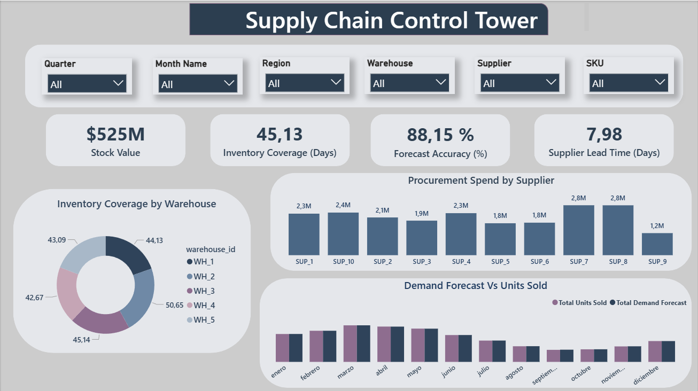
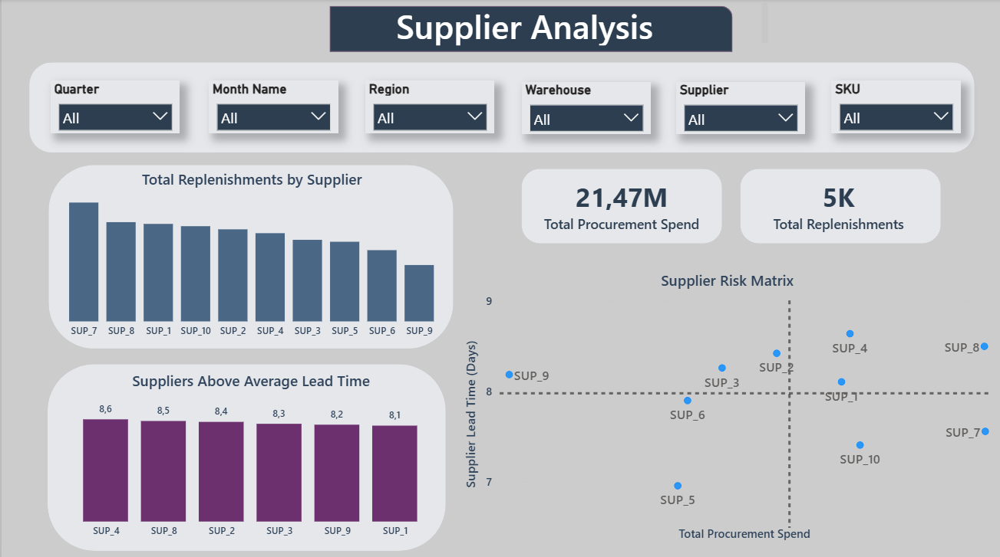
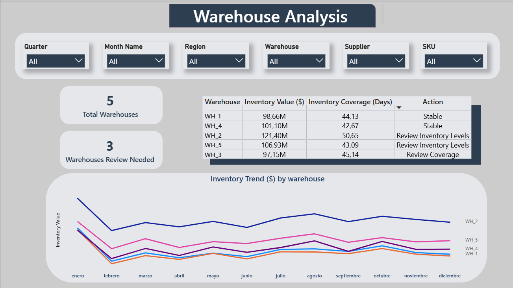
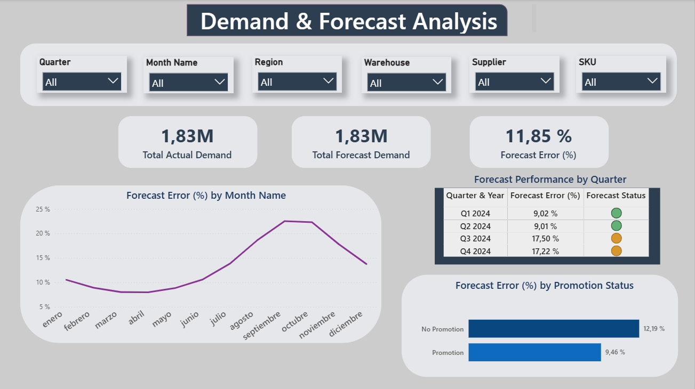
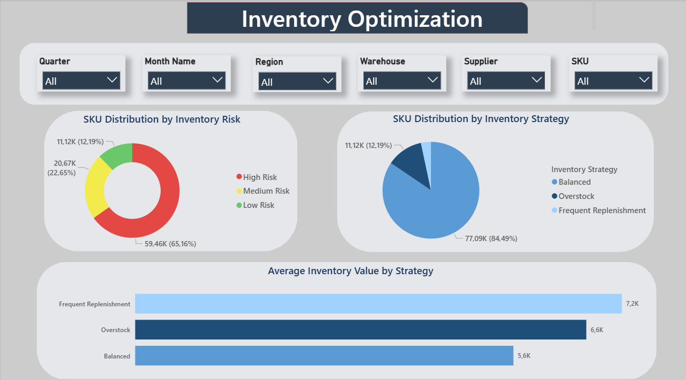

# Supply Chain Control Tower

## Descripción del Proyecto

La gestión de una cadena de suministro implica coordinar múltiples áreas que están estrechamente relacionadas entre sí. Decisiones relacionadas con inventario, proveedores, almacenes o planificación de la demanda pueden tener un impacto directo en los costes operativos, la disponibilidad de producto y el nivel de servicio ofrecido al cliente.

En muchas ocasiones, la información necesaria para tomar decisiones se encuentra distribuida entre diferentes sistemas y reportes, dificultando la obtención de una visión global de la operación.

Para dar respuesta a este reto, se desarrolló una **Supply Chain Control Tower**, una solución analítica que integra información de inventario, proveedores, almacenes y demanda en una única plataforma, permitiendo monitorizar indicadores clave y facilitar la toma de decisiones basada en datos.

## Objetivo del Proyecto

Desarrollar una solución analítica end-to-end capaz de proporcionar visibilidad sobre las principales áreas de la cadena de suministro mediante el uso de Python, SQL y Power BI.

Los objetivos específicos fueron:

* Mejorar la visibilidad del inventario.
* Analizar el rendimiento de los proveedores.
* Identificar almacenes que requieren atención.
* Evaluar la calidad de las previsiones de demanda.
* Detectar riesgos y oportunidades de optimización.
* Facilitar la toma de decisiones mediante indicadores accionables.

## Preguntas de Negocio

El proyecto se desarrolló para responder a las siguientes preguntas:

### Inventario

* ¿Tenemos niveles adecuados de inventario?
* ¿Qué productos presentan mayor riesgo operativo?
* ¿Existen oportunidades para optimizar el stock?

### Proveedores

* ¿Qué proveedores generan mayor impacto económico?
* ¿Existen diferencias significativas en los tiempos de entrega?
* ¿Qué proveedores requieren seguimiento?

### Almacenes

* ¿Qué almacenes requieren revisión?
* ¿Cómo se distribuye el inventario entre almacenes?
* ¿Existen diferencias relevantes en cobertura y valor de stock?

### Demanda

* ¿Estamos planificando correctamente la demanda?
* ¿Cuál es el nivel de precisión de nuestras previsiones?
* ¿Qué impacto tienen las promociones sobre la demanda?

## Dataset

El dataset utilizado simula un entorno real de Supply Chain e integra información procedente de diferentes procesos operativos.

### Inventario

* SKU
* Inventory Level
* Inventory Value
* Inventory Coverage
* Stock Allocation

### Proveedores

* Supplier
* Lead Time
* Procurement Spend
* Replenishments

### Almacenes

* Warehouse
* Inventory Distribution
* Inventory Allocation

### Demanda

* Actual Demand
* Forecast Demand
* Promotion Impact

Esta combinación de variables permitió analizar la cadena de suministro desde una perspectiva integrada y desarrollar indicadores orientados a la toma de decisiones.

## Metodología

El proyecto se desarrolló siguiendo un enfoque analítico estructurado:

### 1. Exploración y comprensión de datos

Se realizó un análisis exploratorio para comprender la estructura del dataset, identificar variables relevantes y detectar posibles inconsistencias.

### 2. Limpieza y transformación de datos

Mediante Python se llevaron a cabo tareas de:

* Limpieza de datos.
* Conversión de tipos de variables.
* Tratamiento de valores nulos.
* Creación de métricas derivadas.
* Preparación de la información para su análisis posterior.

### 3. Análisis mediante SQL

Se empleó SQL para:

* Agrupar información.
* Analizar métricas por proveedor.
* Evaluar el rendimiento de almacenes.
* Calcular indicadores de demanda e inventario.

### 4. Definición de KPIs

Se diseñaron indicadores específicos para monitorizar el rendimiento de la operación.

### 5. Desarrollo del Dashboard

Finalmente, se desarrolló una solución interactiva en Power BI utilizando:

* Power Query.
* Modelado de datos.
* DAX.
* Visualizaciones interactivas.
* Navegación entre páginas.
* Filtros dinámicos.

## KPIs Analizados

### Inventory Value

Representa el valor económico total del inventario disponible. Permite conocer el capital inmovilizado en stock y evaluar el impacto financiero asociado a la gestión del inventario.

### Inventory Coverage

Indica el número de días que la demanda puede cubrirse utilizando el inventario actual. Es una métrica clave para identificar riesgos de rotura de stock o situaciones de sobreinventario.

### Procurement Spend

Representa el gasto total destinado a compras y aprovisionamiento. Permite monitorizar el impacto económico de los proveedores y analizar oportunidades de optimización de costes.

### Supplier Lead Time

Mide el tiempo medio que tarda un proveedor en entregar un pedido desde que se realiza la solicitud. Es un indicador fundamental para la planificación de compras y la disponibilidad de producto.

### Replenishments

Mide el número de reposiciones realizadas para mantener los niveles de inventario. Este KPI ayuda a comprender la frecuencia de abastecimiento y el comportamiento del stock dentro de la cadena de suministro.

### Forecast Accuracy

Evalúa el grado de precisión de las previsiones de demanda comparando la demanda prevista con la demanda real. Una mayor precisión permite optimizar la planificación, reducir costes y mejorar el nivel de servicio.

### Forecast Error

Mide la desviación existente entre la demanda prevista y la demanda real. Este indicador permite identificar áreas de mejora en los procesos de planificación.

## Dashboard

La solución se estructuró en cinco áreas principales de análisis.

### Overview

Vista ejecutiva que reúne los principales indicadores de rendimiento de la cadena de suministro y proporciona una visión global de la operación.

### Supplier Analysis

Permite evaluar el rendimiento de los proveedores mediante métricas como Procurement Spend, Lead Time y Replenishments, facilitando la identificación de proveedores estratégicos y posibles riesgos operativos.

### Warehouse Analysis

Analiza la situación de los almacenes mediante indicadores de cobertura, valor de inventario y distribución del stock, permitiendo identificar almacenes que requieren seguimiento.

### Demand & Forecast Analysis

Evalúa la calidad de las previsiones mediante Forecast Accuracy y Forecast Error, así como la relación entre demanda prevista y demanda real.

### Inventory Optimization

Clasifica los productos según diferentes niveles de riesgo (High, Medium y Low) utilizando criterios relacionados con cobertura, demanda y comportamiento del stock.

Esta clasificación permite priorizar acciones y focalizar los esfuerzos en aquellos productos con mayor probabilidad de generar incidencias operativas o costes innecesarios.

### Funcionalidades Interactivas

El dashboard incorpora:

* Filtros por proveedor.
* Filtros por almacén.
* Filtros por SKU.
* Navegación entre páginas.
* Cross-filtering entre visualizaciones.
* Exploración dinámica de indicadores.

## Tecnologías Utilizadas

### Lenguajes

* Python
* SQL
* DAX

### Herramientas

* Power BI
* Power Query
* Jupyter Notebook
* GitHub

### Librerías

* Pandas
* NumPy
* Matplotlib
* Seaborn

## Observaciones

* La planificación de la demanda mostró niveles elevados de precisión, con un Forecast Accuracy superior al 88%.
* Se identificaron almacenes que requieren seguimiento debido a sus niveles de cobertura.
* Existen diferencias relevantes en los tiempos de entrega entre proveedores.
* Una parte significativa de los SKUs fue clasificada como High Risk, lo que pone de manifiesto oportunidades para revisar estrategias de inventario y priorizar acciones sobre los productos más críticos.
* La combinación de métricas de demanda, inventario, almacenes y proveedores proporciona una visión más completa de la operación y facilita la identificación temprana de riesgos.

## Conclusiones

Este proyecto demuestra cómo la integración de información procedente de distintas áreas de la cadena de suministro puede transformarse en una herramienta útil para apoyar la toma de decisiones.

La solución desarrollada proporciona visibilidad sobre inventario, proveedores, almacenes y demanda, permitiendo identificar riesgos, detectar oportunidades de mejora y facilitar una gestión más eficiente de la operación.

## Próximos Pasos

Durante el desarrollo del proyecto se realizó la conexión con una API de tipos de cambio con el objetivo de convertir los valores monetarios a euros y explorar posibles análisis financieros dentro de la cadena de suministro.

Aunque la integración se completó correctamente y los datos fueron incorporados al proceso de análisis, finalmente se decidió no incluir esta información en la versión final del dashboard para centrar el proyecto en los indicadores operativos de inventario, proveedores, almacenes y demanda.

Como evolución futura, esta integración podría utilizarse para analizar el impacto de las fluctuaciones de divisa, comparar costes entre mercados o incorporar una perspectiva financiera más completa a la toma de decisiones.

