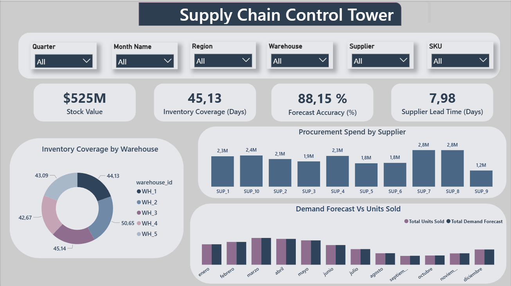
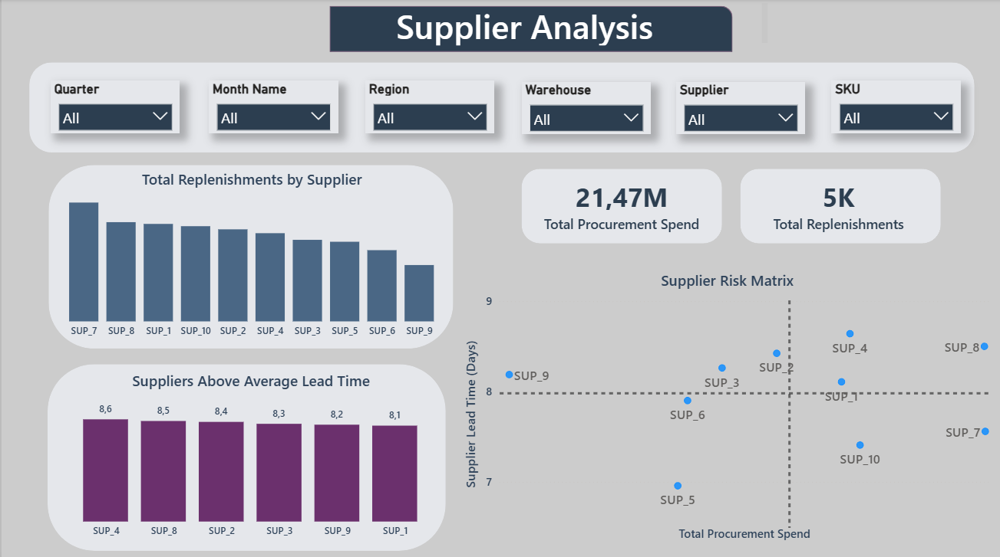
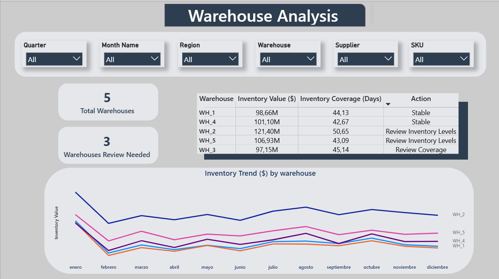
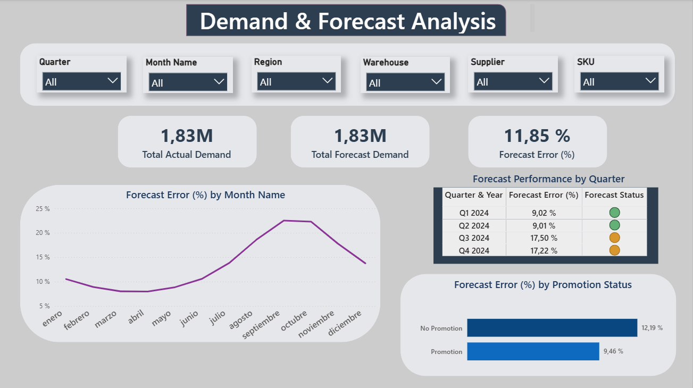
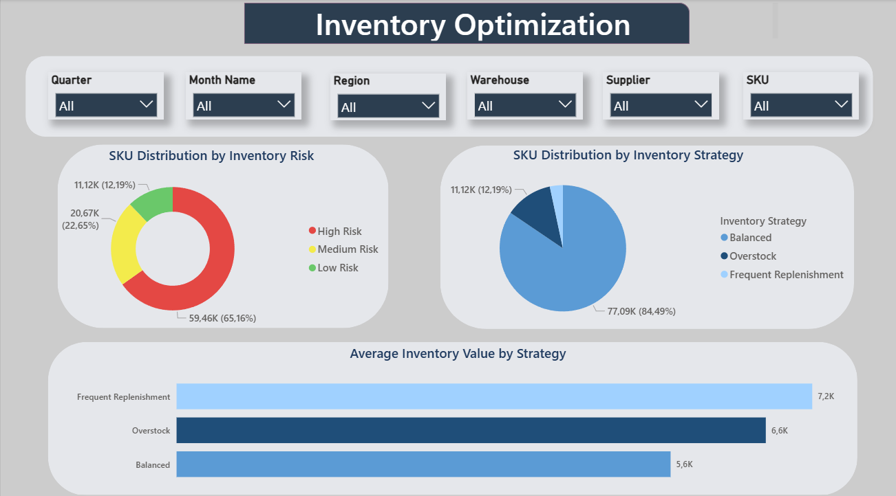

# Supply Chain Control Tower

## Project Description

Managing a supply chain requires coordinating multiple areas that are closely connected. Decisions related to inventory, suppliers, warehouses or demand planning can have a direct impact on operational costs, product availability and customer service.

In many organizations, the information required to make these decisions is spread across different systems and reports, making it difficult to gain a complete view of the operation.

To address this challenge, I developed a **Supply Chain Control Tower**, an analytical solution that brings together inventory, supplier, warehouse and demand data into a single platform, making it easier to monitor key business indicators and support data-driven decision making.

---

## Project Objective

The goal of this project was to develop an end-to-end analytical solution capable of providing visibility across the main areas of the supply chain using Python, SQL and Power BI.

The main objectives were to:

- Improve inventory visibility.
- Analyse supplier performance.
- Identify warehouses that require attention.
- Evaluate demand forecast quality.
- Detect risks and optimization opportunities.
- Support decision making through actionable KPIs.

---

## Business Questions

This project was designed to answer the following business questions.

### Inventory

- Are inventory levels appropriate?
- Which products present the highest operational risk?
- Are there opportunities to optimize inventory?

### Suppliers

- Which suppliers have the greatest financial impact?
- Are there significant differences in supplier lead times?
- Which suppliers require closer monitoring?

### Warehouses

- Which warehouses require attention?
- How is inventory distributed across warehouses?
- Are there significant differences in inventory coverage and stock value?

### Demand

- Are we planning demand accurately?
- How accurate are our demand forecasts?
- What impact do promotions have on demand?

---

## Dataset

The dataset simulates a real Supply Chain environment and combines information from different operational processes.

### Inventory

- SKU
- Inventory Level
- Inventory Value
- Inventory Coverage
- Stock Allocation

### Suppliers

- Supplier
- Lead Time
- Procurement Spend
- Replenishments

### Warehouses

- Warehouse
- Inventory Distribution
- Inventory Allocation

### Demand

- Actual Demand
- Forecast Demand
- Promotion Impact

This combination of variables made it possible to analyse the supply chain from an integrated perspective and build business-oriented KPIs.

---

## Methodology

The project followed a structured analytical approach.

### 1. Data Exploration

An exploratory analysis was carried out to understand the dataset structure, identify relevant variables and detect potential inconsistencies.

### 2. Data Cleaning & Transformation

Python was used to perform several data preparation tasks, including:

- Data cleaning.
- Data type conversion.
- Missing value treatment.
- Creation of derived metrics.
- Data preparation for further analysis.

### 3. SQL Analysis

SQL was used to:

- Aggregate business information.
- Analyse supplier performance.
- Evaluate warehouse performance.
- Calculate inventory and demand metrics.

### 4. KPI Definition

A set of business KPIs was designed to monitor operational performance.

### 5. Dashboard Development

Finally, an interactive Power BI dashboard was developed using:

- Power Query
- Data Modelling
- DAX
- Interactive visualizations
- Page navigation
- Dynamic filters

---

## Key KPIs

### Inventory Value

Represents the total financial value of the available inventory. It provides visibility into the capital tied up in stock and its financial impact.

### Inventory Coverage

Measures how many days current inventory can cover expected demand. It helps identify both stockout risks and overstock situations.

### Procurement Spend

Represents the total amount spent on procurement activities. It helps evaluate supplier impact and identify cost optimization opportunities.

### Supplier Lead Time

Measures the average time required for a supplier to deliver an order after it has been placed. It is a key indicator for procurement planning and product availability.

### Replenishments

Measures the number of replenishment activities carried out to maintain inventory levels. This KPI provides insight into replenishment frequency and inventory behaviour.

### Forecast Accuracy

Measures how closely forecast demand matches actual demand. Higher forecast accuracy contributes to better planning, lower costs and improved service levels.

### Forecast Error

Measures the deviation between forecast demand and actual demand, helping identify opportunities to improve the forecasting process.

---

## Dashboard

The dashboard is organised into five main analytical sections.

### Overview

Provides an executive summary of the supply chain through the most relevant operational KPIs.

### Supplier Analysis

Evaluates supplier performance using Procurement Spend, Lead Time and Replenishments, helping identify strategic suppliers and potential operational risks.

### Warehouse Analysis

Analyses warehouse performance through inventory coverage, stock value and inventory distribution, making it easier to identify warehouses that require attention.

### Demand & Forecast Analysis

Evaluates forecast quality through Forecast Accuracy and Forecast Error while comparing forecast demand with actual demand.

### Inventory Optimization

Classifies products into High, Medium and Low Risk categories based on inventory coverage, demand and inventory behaviour.

This helps prioritize actions and focus attention on products that are more likely to generate operational issues or unnecessary costs.

### Interactive Features

The dashboard includes:

- Supplier filters
- Warehouse filters
- SKU filters
- Page navigation
- Cross-filtering between visuals
- Interactive KPI exploration

---

## Technologies Used

### Languages

- Python
- SQL
- DAX

### Tools

- Power BI
- Power Query
- Jupyter Notebook
- GitHub

### Libraries

- Pandas
- NumPy
- Matplotlib
- Seaborn

---

## Key Insights

- Demand planning achieved a Forecast Accuracy above 88%.
- Several warehouses were identified as requiring attention due to their inventory coverage levels.
- Significant differences were found in supplier lead times.
- A considerable number of SKUs were classified as High Risk, highlighting opportunities to review inventory strategies and prioritize critical products.
- Combining demand, inventory, warehouse and supplier metrics provides a more complete operational view and supports early risk identification.

---

## Conclusions

This project demonstrates how integrating information from different areas of the supply chain can become a valuable decision-support tool.

The solution provides visibility across inventory, suppliers, warehouses and demand, helping identify risks, uncover improvement opportunities and support more efficient operational management.

---

## Future Improvements

During the project, an exchange rate API was integrated to convert monetary values into euros and explore additional financial analysis within the supply chain.

Although the integration was completed successfully and incorporated into the data preparation process, it was ultimately excluded from the final dashboard in order to keep the focus on operational indicators related to inventory, suppliers, warehouses and demand.

As a future enhancement, this integration could be used to analyse the impact of currency fluctuations, compare costs across different markets and provide a more comprehensive financial perspective for decision making.

